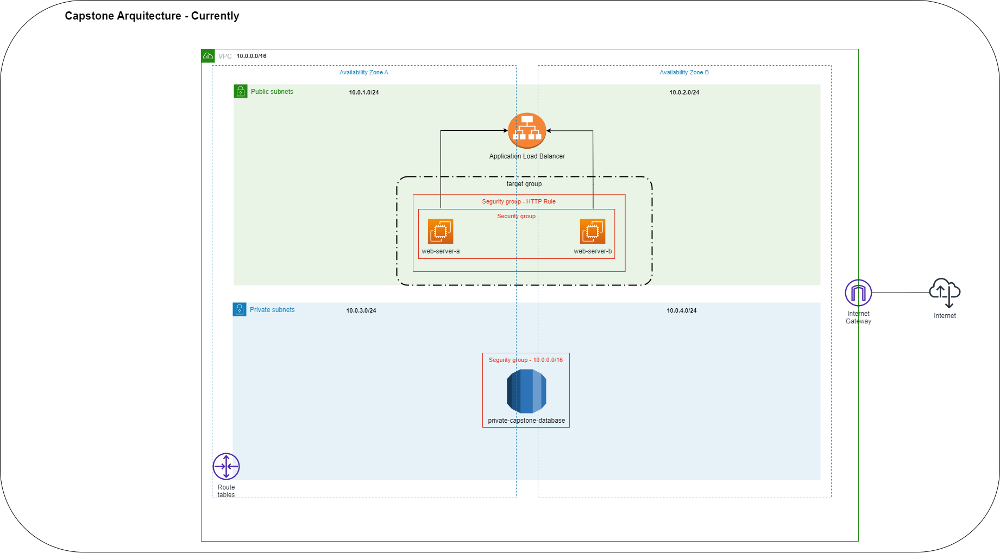

## Capstone Arquitecture - Currently

#### Analysis

The application...

* Have a **load balancer** for divide request on twice **ec2 instances**.
* Have a **segurity group** for these **ec2 instances** with a rule for **allow all trafic** from loadbalancer segurity group.
* The **security group** attached to **loadbalancer** allow only access to **port 80 from all world**.
* Exist a database on with a subnet group that  just have **private subnets**, this have a segurity group that just **allow access** just for **10.0.0.0/16 network**.
